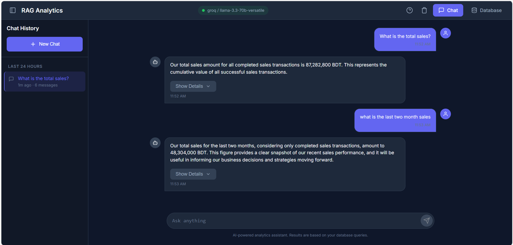
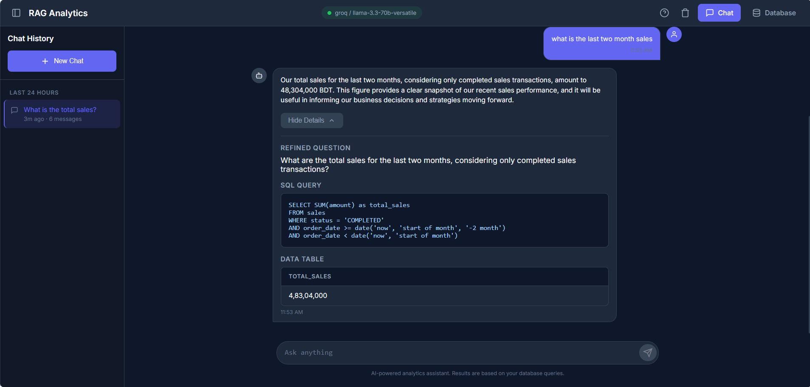

# RAG Analytics System

A conversational analytics interface that lets you query business data using natural language - just like chatting with ChatGPT, but for your database.

Built with **FastAPI**, **Angular**, and **RAG (Retrieval Augmented Generation)**.

## Screenshots






## How It Works

Ask questions in plain English and get instant answers.


**Example queries:**
- "What were the total sales in Q4 2025?"
- "Which region has the highest revenue?"
- "Show me top 5 selling products this year"

## Getting Started

### Prerequisites

- Python 3.10+
- Node.js 18+

### Backend Setup

```bash
cd fastapi-app
python -m venv env
.\env\Scripts\activate        # Windows
source env/bin/activate       # Linux/Mac
pip install -r requirements.txt
cp .env.example .env          # Add your LLM API key
python main.py
```

API runs at `http://localhost:8009`

### Frontend Setup

```bash
cd angular-app
npm install
ng serve
```

App runs at `http://localhost:4200`

## LLM Providers

| Provider | Free Tier | Get Started |
|----------|-----------|-------------|
| **Groq** (Recommended) | 30 req/min | [Get Key](https://console.groq.com/keys) |
| **Google Gemini** | 15 req/min | [Get Key](https://aistudio.google.com/app/apikey) |
| **Ollama** | Unlimited (local) | [Download](https://ollama.ai) |

Configure in `.env`:

```env
LLM_PROVIDER=groq
LLM_API_KEY=your_api_key_here
LLM_MODEL=llama-3.3-70b-versatile
```

## Project Structure

```
├── fastapi-app/              # Backend
│   ├── app/
│   │   ├── api/              # REST endpoints
│   │   ├── models/           # Database models
│   │   └── services/         # RAG pipeline, LLM integration, vector store
│   └── main.py
│
├── angular-app/              # Frontend
│   └── src/app/
│       ├── components/       # Chat, Database Explorer
│       └── services/         # API client
```

## API Reference

| Method | Endpoint | Description |
|--------|----------|-------------|
| POST | `/api/v1/chat` | Send a natural language query |
| GET | `/api/v1/health` | Health check |
| GET | `/api/v1/database/tables` | List all tables |
| GET | `/api/v1/database/tables/{name}` | Get table data |


