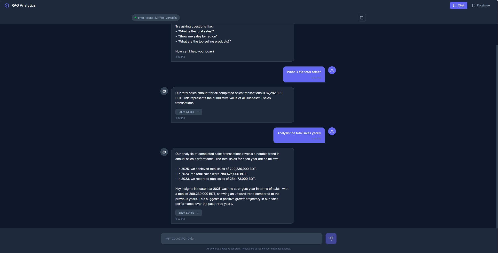
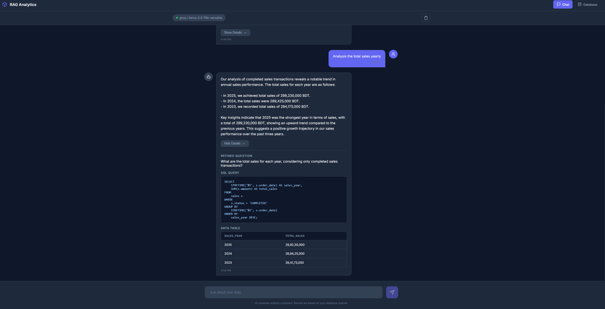
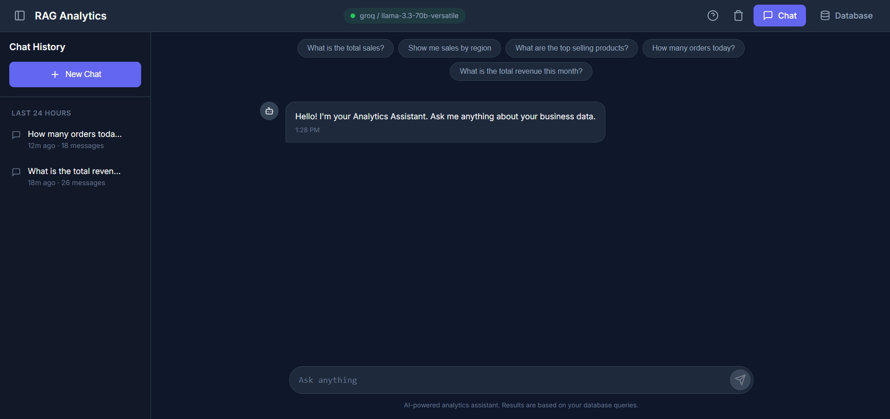

# RAG Analytics System

A ChatGPT-style conversational analytics interface that lets you query your business ERP data using natural language. Built with **FastAPI**, **Angular**, and **RAG (Retrieval Augmented Generation)** technology.

## 📸 Screenshots

### Chat Interface
*Ask questions in natural language and get instant analytics*



### SQL & Data Details
*View the generated SQL queries and raw data tables*



### Database Explorer
*Browse all your ERP tables with pagination*



---

## 🎯 Overview

This system transforms natural language questions into SQL queries, executes them against your business database, and returns human-readable answers. No SQL knowledge required!

**Example Queries:**
- "What were the total sales in Q4 2024?"
- "Which region has the highest revenue?"
- "Show me top 5 selling products this year"
- "Compare sales between 2023 and 2024"

---

## 🏗️ System Architecture

```
┌─────────────────────────────────────────────────────────────────────────────┐
│                           RAG ANALYTICS SYSTEM                               │
├─────────────────────────────────────────────────────────────────────────────┤
│                                                                              │
│  ┌──────────────┐         ┌──────────────────────────────────────────────┐  │
│  │   Angular    │         │              FastAPI Backend                  │  │
│  │   Frontend   │ ──────► │                                              │  │
│  │              │   HTTP  │  ┌─────────────────────────────────────────┐ │  │
│  │  • Chat UI   │         │  │           RAG PIPELINE                   │ │  │
│  │  • DB View   │         │  │                                         │ │  │
│  └──────────────┘         │  │  ┌─────────┐    ┌──────────────────┐   │ │  │
│                           │  │  │ Step 1  │    │    ChromaDB      │   │ │  │
│                           │  │  │ Context │◄───│  Vector Store    │   │ │  │
│                           │  │  │Retrieval│    │                  │   │ │  │
│                           │  │  └────┬────┘    │ • Data Dictionary│   │ │  │
│                           │  │       │         │ • Business Rules │   │ │  │
│                           │  │       ▼         │ • Metrics Def.   │   │ │  │
│                           │  │  ┌─────────┐    └──────────────────┘   │ │  │
│                           │  │  │ Step 2  │                           │ │  │
│                           │  │  │   LLM   │◄──── Groq / Gemini /      │ │  │
│                           │  │  │  Call 1 │      Ollama / OpenAI      │ │  │
│                           │  │  │         │                           │ │  │
│                           │  │  │ • Query Refinement                  │ │  │
│                           │  │  │ • SQL Generation                    │ │  │
│                           │  │  └────┬────┘                           │ │  │
│                           │  │       │                                │ │  │
│                           │  │       ▼                                │ │  │
│                           │  │  ┌─────────┐    ┌──────────────────┐   │ │  │
│                           │  │  │ Step 3  │    │     SQLite       │   │ │  │
│                           │  │  │   SQL   │───►│    Database      │   │ │  │
│                           │  │  │ Execute │    │                  │   │ │  │
│                           │  │  └────┬────┘    │ • Sales          │   │ │  │
│                           │  │       │         │ • Products       │   │ │  │
│                           │  │       ▼         │ • Customers      │   │ │  │
│                           │  │  ┌─────────┐    │ • Regions        │   │ │  │
│                           │  │  │ Step 4  │    │ • Invoices       │   │ │  │
│                           │  │  │   LLM   │    │ • Expenses       │   │ │  │
│                           │  │  │  Call 2 │    └──────────────────┘   │ │  │
│                           │  │  │         │                           │ │  │
│                           │  │  │ • Answer Composition                │ │  │
│                           │  │  │ • Business Formatting               │ │  │
│                           │  │  └─────────┘                           │ │  │
│                           │  │                                         │ │  │
│                           │  └─────────────────────────────────────────┘ │  │
│                           │                                              │  │
│                           └──────────────────────────────────────────────┘  │
│                                                                              │
└─────────────────────────────────────────────────────────────────────────────┘
```

---

## 🔄 RAG Pipeline Flow

```
┌─────────────────────────────────────────────────────────────────────────────┐
│                         HOW THE RAG PIPELINE WORKS                          │
└─────────────────────────────────────────────────────────────────────────────┘

User Question: "What were total sales by region last month?"
                                    │
                                    ▼
┌─────────────────────────────────────────────────────────────────────────────┐
│  STEP 1: CONTEXT RETRIEVAL (Vector Search)                                  │
│  ─────────────────────────────────────────                                  │
│                                                                              │
│  ChromaDB searches for relevant context:                                    │
│                                                                              │
│  ┌─────────────────┐  ┌─────────────────┐  ┌─────────────────┐             │
│  │ Data Dictionary │  │ Business Rules  │  │ Metric Defs     │             │
│  │                 │  │                 │  │                 │             │
│  │ • sales table   │  │ • Only count    │  │ • Total Sales = │             │
│  │ • regions table │  │   COMPLETED     │  │   SUM(amount)   │             │
│  │ • columns info  │  │   orders        │  │   WHERE status  │             │
│  │                 │  │ • Use BDT       │  │   = COMPLETED   │             │
│  └─────────────────┘  └─────────────────┘  └─────────────────┘             │
│                                                                              │
│  Retrieved Context: Table schemas, business rules, metric formulas          │
└─────────────────────────────────────────────────────────────────────────────┘
                                    │
                                    ▼
┌─────────────────────────────────────────────────────────────────────────────┐
│  STEP 2: LLM CALL 1 - Query Refinement + SQL Generation                     │
│  ──────────────────────────────────────────────────────                     │
│                                                                              │
│  INPUT:                                                                      │
│  ┌──────────────────────────────────────────────────────────────────┐       │
│  │ User Question: "What were total sales by region last month?"      │       │
│  │ Context: [table schemas, business rules, metric definitions]      │       │
│  └──────────────────────────────────────────────────────────────────┘       │
│                                    │                                         │
│                                    ▼                                         │
│                           ┌───────────────┐                                  │
│                           │   LLM (Groq)  │                                  │
│                           │   Llama 3.3   │                                  │
│                           └───────────────┘                                  │
│                                    │                                         │
│                                    ▼                                         │
│  OUTPUT:                                                                     │
│  ┌──────────────────────────────────────────────────────────────────┐       │
│  │ Refined Question: "What is the total sales amount by region       │       │
│  │                    for November 2024?"                            │       │
│  │                                                                   │       │
│  │ SQL Query:                                                        │       │
│  │   SELECT r.name as region, SUM(s.amount) as total_sales          │       │
│  │   FROM sales s                                                    │       │
│  │   JOIN regions r ON s.region_id = r.id                           │       │
│  │   WHERE s.status = 'COMPLETED'                                    │       │
│  │     AND s.order_date >= date('now', 'start of month', '-1 month')│       │
│  │     AND s.order_date < date('now', 'start of month')             │       │
│  │   GROUP BY r.name                                                 │       │
│  │   ORDER BY total_sales DESC                                       │       │
│  └──────────────────────────────────────────────────────────────────┘       │
└─────────────────────────────────────────────────────────────────────────────┘
                                    │
                                    ▼
┌─────────────────────────────────────────────────────────────────────────────┐
│  STEP 3: SQL EXECUTION                                                      │
│  ────────────────────                                                       │
│                                                                              │
│  ┌────────────────┐         ┌─────────────────────────────────────┐        │
│  │   SQL Query    │ ──────► │          SQLite Database            │        │
│  └────────────────┘         │                                     │        │
│                             │  ┌─────────────────────────────┐   │        │
│                             │  │ Results:                     │   │        │
│                             │  │ ┌────────────┬─────────────┐ │   │        │
│                             │  │ │ region     │ total_sales │ │   │        │
│                             │  │ ├────────────┼─────────────┤ │   │        │
│                             │  │ │ Dhaka      │ 2,450,000   │ │   │        │
│                             │  │ │ Chattogram │ 1,820,000   │ │   │        │
│                             │  │ │ Sylhet     │ 980,000     │ │   │        │
│                             │  │ │ Rajshahi   │ 750,000     │ │   │        │
│                             │  │ │ Khulna     │ 620,000     │ │   │        │
│                             │  │ └────────────┴─────────────┘ │   │        │
│                             │  └─────────────────────────────┘   │        │
│                             └─────────────────────────────────────┘        │
└─────────────────────────────────────────────────────────────────────────────┘
                                    │
                                    ▼
┌─────────────────────────────────────────────────────────────────────────────┐
│  STEP 4: LLM CALL 2 - Answer Composition                                    │
│  ───────────────────────────────────────                                    │
│                                                                              │
│  INPUT:                                                                      │
│  ┌──────────────────────────────────────────────────────────────────┐       │
│  │ Refined Question: "Total sales by region for November 2024"       │       │
│  │ SQL Results: [{region: "Dhaka", total: 2450000}, ...]            │       │
│  └──────────────────────────────────────────────────────────────────┘       │
│                                    │                                         │
│                                    ▼                                         │
│                           ┌───────────────┐                                  │
│                           │   LLM (Groq)  │                                  │
│                           │   Llama 3.3   │                                  │
│                           └───────────────┘                                  │
│                                    │                                         │
│                                    ▼                                         │
│  OUTPUT:                                                                     │
│  ┌──────────────────────────────────────────────────────────────────┐       │
│  │  "Here's the sales breakdown by region for November 2024:        │       │
│  │                                                                   │       │
│  │   1. **Dhaka** leads with 24,50,000 BDT (37% of total)           │       │
│  │   2. **Chattogram** follows with 18,20,000 BDT (27%)             │       │
│  │   3. **Sylhet** contributed 9,80,000 BDT (15%)                   │       │
│  │   4. **Rajshahi** recorded 7,50,000 BDT (11%)                    │       │
│  │   5. **Khulna** had 6,20,000 BDT (10%)                           │       │
│  │                                                                   │       │
│  │   Total sales across all regions: 66,20,000 BDT                  │       │
│  │                                                                   │       │
│  │   Key Insight: Dhaka and Chattogram together account for         │       │
│  │   64% of total sales."                                           │       │
│  └──────────────────────────────────────────────────────────────────┘       │
└─────────────────────────────────────────────────────────────────────────────┘
                                    │
                                    ▼
                        ┌───────────────────┐
                        │   Final Answer    │
                        │   Displayed to    │
                        │      User         │
                        └───────────────────┘
```

---

## 📊 Database Schema

```
┌─────────────────────────────────────────────────────────────────────────────┐
│                          ERP DATABASE SCHEMA                                 │
└─────────────────────────────────────────────────────────────────────────────┘

┌──────────────┐       ┌──────────────┐       ┌──────────────┐
│   REGIONS    │       │   PRODUCTS   │       │  CUSTOMERS   │
├──────────────┤       ├──────────────┤       ├──────────────┤
│ id (PK)      │       │ id (PK)      │       │ id (PK)      │
│ name         │       │ name         │       │ name         │
│ country      │       │ category     │       │ email        │
│ created_at   │       │ unit_price   │       │ phone        │
└──────┬───────┘       │ cost_price   │       │ region_id(FK)│
       │               │ description  │       │ customer_type│
       │               │ created_at   │       │ created_at   │
       │               └──────┬───────┘       └──────┬───────┘
       │                      │                      │
       │     ┌────────────────┴──────────────────────┘
       │     │
       ▼     ▼
┌──────────────────────────────────────────┐
│                  SALES                    │
├──────────────────────────────────────────┤
│ id (PK)                                  │
│ order_date                               │
│ product_id (FK) ─────────────────────────┤
│ customer_id (FK) ────────────────────────┤
│ region_id (FK) ──────────────────────────┤
│ quantity                                 │
│ unit_price                               │
│ discount                                 │
│ amount                                   │
│ status (COMPLETED/PENDING/CANCELLED)     │
│ payment_method                           │
│ created_at                               │
└──────────────────────────────────────────┘
       │
       │
       ▼
┌──────────────┐       ┌──────────────┐
│   INVOICES   │       │   EXPENSES   │
├──────────────┤       ├──────────────┤
│ id (PK)      │       │ id (PK)      │
│ invoice_num  │       │ expense_date │
│ sale_id (FK) │       │ category     │
│ invoice_date │       │ description  │
│ due_date     │       │ amount       │
│ total_amount │       │ region_id(FK)│
│ paid_amount  │       │ created_at   │
│ status       │       └──────────────┘
│ created_at   │
└──────────────┘
```

---

## 🚀 Quick Start

### Prerequisites

- Python 3.10+
- Node.js 18+
- Git

### 1. Clone the Repository

```bash
git clone https://github.com/YOUR_USERNAME/rag-analytics.git
cd rag-analytics
```

### 2. Setup Backend (FastAPI)

```bash
cd fastapi-app

# Create virtual environment
python -m venv env

# Activate (Windows)
.\env\Scripts\activate

# Activate (Linux/Mac)
source env/bin/activate

# Install dependencies
pip install -r requirements.txt

# Copy environment file
cp .env.example .env

# Edit .env and add your API key (get free key from https://console.groq.com/keys)
# LLM_API_KEY=your_groq_api_key_here

# Run the server
python main.py
```

The API will be available at `http://localhost:8000`

### 3. Setup Frontend (Angular)

```bash
cd angular-app

# Install dependencies
npm install

# Run development server
ng serve
```

The app will be available at `http://localhost:4200`

---

## 🔑 LLM Provider Options (FREE!)

| Provider | Free Tier | Speed | Setup |
|----------|-----------|-------|-------|
| **Groq** (Recommended) | 30 req/min, 6000/day | Very Fast | [Get Key](https://console.groq.com/keys) |
| **Google Gemini** | 15 req/min, 1500/day | Fast | [Get Key](https://aistudio.google.com/app/apikey) |
| **Ollama** | Unlimited (local) | Depends on hardware | [Download](https://ollama.ai) |
| **OpenAI** | Paid only | Fast | [Get Key](https://platform.openai.com) |

### Configure in `.env`:

```env
# For Groq (Recommended)
LLM_PROVIDER=groq
LLM_API_KEY=your_groq_api_key_here
LLM_MODEL=llama-3.3-70b-versatile

# For Gemini
LLM_PROVIDER=gemini
LLM_API_KEY=your_gemini_api_key_here
LLM_MODEL=gemini-2.0-flash

# For Ollama (Local)
LLM_PROVIDER=ollama
LLM_API_KEY=not_needed
LLM_MODEL=llama3.1
```

---

## 📁 Project Structure

```
rag-analytics/
├── fastapi-app/                 # Backend API
│   ├── app/
│   │   ├── api/
│   │   │   └── routes.py        # API endpoints
│   │   ├── models/
│   │   │   ├── database.py      # SQLAlchemy models
│   │   │   └── schemas.py       # Pydantic schemas
│   │   ├── services/
│   │   │   ├── llm_service.py   # LLM provider integration
│   │   │   ├── rag_pipeline.py  # RAG orchestration
│   │   │   ├── vector_store.py  # ChromaDB integration
│   │   │   ├── database_service.py
│   │   │   ├── knowledge_base.py
│   │   │   └── seed_data.py     # Sample data generator
│   │   └── config.py            # Configuration
│   ├── main.py                  # FastAPI entry point
│   ├── requirements.txt
│   └── .env.example
│
├── angular-app/                 # Frontend UI
│   ├── src/app/
│   │   ├── components/
│   │   │   ├── chat/            # Chat interface
│   │   │   └── database-explorer/  # Database viewer
│   │   ├── services/
│   │   │   └── chat.service.ts  # API client
│   │   └── models/
│   │       └── chat.models.ts   # TypeScript interfaces
│   └── ...
│
├── .gitignore
└── README.md
```

---

## 🎨 Features

### Chat Interface
- Natural language queries
- Real-time responses
- View generated SQL
- See data tables
- Conversation history

### Database Explorer
- Browse all tables
- View table data
- Pagination support
- Column information

---

## 📈 Sample Data

The system comes with sample ERP data (2023-2025):

| Table | Records | Description |
|-------|---------|-------------|
| Regions | 5 | Bangladesh divisions |
| Products | 10 | Electronics, Furniture, Stationery |
| Customers | 12 | Retail, Wholesale, Corporate |
| Sales | ~10,000 | Daily transactions |
| Invoices | ~3,000 | From completed sales |
| Expenses | ~600 | Weekly expenses |

---

## 🔒 Security

- SQL injection prevention (read-only queries)
- Environment variables for secrets
- CORS configuration
- Input validation

---

## 📝 API Endpoints

| Method | Endpoint | Description |
|--------|----------|-------------|
| POST | `/api/v1/chat` | Send natural language query |
| GET | `/api/v1/health` | Health check |
| GET | `/api/v1/schema` | Get database schema |
| GET | `/api/v1/database/tables` | List all tables |
| GET | `/api/v1/database/tables/{name}` | Get table data |

---

## 🤝 Contributing

1. Fork the repository
2. Create your feature branch (`git checkout -b feature/amazing-feature`)
3. Commit your changes (`git commit -m 'Add amazing feature'`)
4. Push to the branch (`git push origin feature/amazing-feature`)
5. Open a Pull Request

---

## 📄 License

MIT License - feel free to use this project for learning and commercial purposes.

---

## 🙏 Acknowledgments

- [Groq](https://groq.com) - Fast LLM inference
- [ChromaDB](https://www.trychroma.com) - Vector database
- [FastAPI](https://fastapi.tiangolo.com) - Modern Python web framework
- [Angular](https://angular.io) - Frontend framework

---

**Built with ❤️ for Business Analytics**
